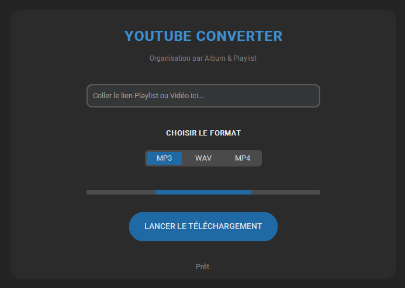

# 🎥 Python Media Processor (GUI)

Une application de bureau moderne pour télécharger et convertir des flux multimédias (YouTube) en formats audio (MP3, WAV) ou vidéo (MP4). Développée avec une interface graphique sombre (Dark Mode).

<p align="center">
  
</p>

## 📋 Prérequis Système
Avant de lancer l'application, assurez-vous d'avoir :
* **Python 3.10** (ou plus récent).
* **FFmpeg** : **Crucial** pour la conversion audio. Doit être installé et ajouté aux variables d'environnement (PATH) de votre système.
    * [Télécharger FFmpeg ici](https://ffmpeg.org/download.html)

## 📦 Installation & Dépendances

1.  **Cloner le dépôt :**
    ```bash
    git clone [https://github.com/Simon-Sec-Mgmt/Python-Media-Processor.git](https://github.com/Simon-Sec-Mgmt/Python-Media-Processor.git)
    cd Python-Media-Processor
    ```

2.  **Installer les librairies Python :**
    Ce projet utilise un fichier `requirements.txt` pour gérer les versions.
    ```bash
    pip install -r requirements.txt
    ```

    *Dépendances principales :*
    * `customtkinter` (Interface graphique moderne)
    * `yt-dlp` (Moteur de téléchargement robuste)

## 🚀 Utilisation

1.  Lancez le script principal depuis votre terminal :
    ```bash
    python main.py
    ```
2.  Collez l'URL d'une vidéo ou d'une playlist YouTube.
3.  Choisissez le format (MP3, WAV, MP4).
4.  Cliquez sur **"LANCER LE TÉLÉCHARGEMENT"**.

*Les fichiers seront automatiquement triés dans vos dossiers `Musique` ou `Vidéos` locaux.*

---

## ⚠️ Avertissement Légal
Cet outil est développé dans un but éducatif et pour l'archivage personnel (Droit de copie privée).
L'utilisateur est seul responsable de l'utilisation qu'il fait de cet outil et doit respecter les droits d'auteur et les conditions d'utilisation de la plateforme YouTube.
